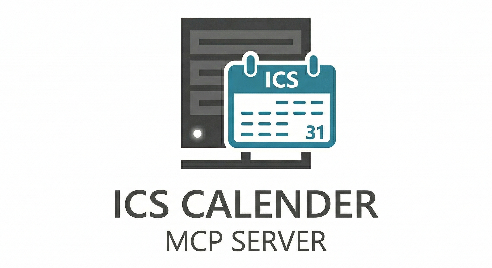

<p align="center">
  
</p>

# ICS Calendar MCP Server

MCP server that merges multiple ICS calendar feeds and exposes them through smart tools. Built with [FastMCP](https://gofastmcp.com/).

Works with any standard ICS feed: **Outlook**, **Google Calendar**, **Apple**, **OST Stundenplan**, etc.

## Tools

| Tool | Description |
|------|-------------|
| `get_events_today` | Get all events for today |
| `get_events_tomorrow` | Get all events for tomorrow |
| `get_events_this_week` | Weekly overview (Mon–Sun) grouped by day |
| `get_next_event` | Next upcoming event with countdown |
| `get_events_by_date` | Events on a specific date |
| `get_events_range` | Events within a date range |
| `search_events` | Keyword search across title, location & description |
| `get_free_slots_today` | Free time slots between events |
| `get_week_overview` | Compact stats: events & hours per day |

## Quick Start

### Docker (recommended)

```bash
cp .env.example .env
# Add your ICS feed URLs to .env

docker compose up -d --build
```

The server runs on `http://localhost:8001/mcp/` (Streamable HTTP transport).

### Local

```bash
pip install .
export CALENDAR_URLS="https://calendar.google.com/.../basic.ics,https://outlook.office365.com/.../calendar.ics"
fastmcp run src.server:mcp --transport streamable-http --host 0.0.0.0 --port 8001
```

## Configuration

| Environment Variable | Description | Default |
|---------------------|-------------|---------|
| `CALENDAR_URLS` | Comma-separated list of ICS feed URLs | *required* |

## MCP Client Configuration

Add to your MCP client config (e.g. Claude Desktop, VS Code):

```json
{
  "mcpServers": {
    "ics-calendar": {
      "url": "http://localhost:8001/mcp/"
    }
  }
}
```

## License

MIT
